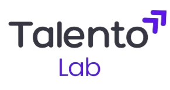

# 🧪 Proyecto QA: Manual Testing de la Plataforma Talento Lab

## 🌐 Plataforma Probada
* **URL (Web):** https://talentolab-test.netlify.app/
* **Objeto de la prueba:** Plataforma web y API REST para la gestión de ofertas laborales y perfiles de usuario.

## 🎯 Objetivo del Proyecto
Este proyecto fue una **simulación completa de un ciclo de Testing QA ágil** (Scrum). El objetivo principal fue **aplicar todas las prácticas de testing y gestión** vistas en el curso (desde el análisis de requerimientos hasta las métricas de cobertura) para garantizar la calidad de la plataforma Talento Lab.

Se buscó integrar todos los artefactos de QA generados a lo largo de 15 clases en un entorno gestionado.

## ⚙️ Metodología y Gestión
* **Marco de trabajo:** Metodología Ágil (Scrum).
* **Gestión de Proyecto:** Se organizó el *backlog* y se simuló un **Sprint completo de 1 semana** utilizando las siguientes herramientas:
    * **Defect Management:** JIRA
    * **Test Management:** Zephyr Scale
* **Enfoque de Requerimientos:** Desglose ágil a partir de *storytelling* (historias de usuario).

## 📊 Tipos de Pruebas Ejecutadas

Se ejecutó un plan de pruebas integral que cubrió una amplia gama de aspectos de calidad:

| Categoría | Tipo de Prueba | Descripción |
| :--- | :--- | :--- |
| **Funcionales** | Pruebas de Flujo, Regresión | Validación de los flujos críticos de la plataforma. |
| **No Funcionales** | Usabilidad, Compatibilidad | Se verificó la experiencia de usuario y la compatibilidad con diferentes navegadores y dispositivos. |
| **Rendimiento** | Pruebas de Resiliencia, Confiabilidad | Evaluación de la estabilidad de la aplicación bajo condiciones normales. |
| **Seguridad** | Seguridad Básica | Pruebas de vulnerabilidad a nivel de formularios y flujo de sesión (ej. validación de entradas). |
| **API Testing** | | Pruebas a los *endpoints* de la API REST utilizando **Postman**. |

## 📦 Áreas de la Aplicación Cubiertas
1.  **Módulo de Autenticación:** Flujo de inicio de sesión y registro de usuario, incluyendo validación de formularios.
2.  **Módulo de Ofertas Laborales:** Funcionalidad de búsqueda, filtrado y visualización de tarjetas de resultados.

## 🛠️ Herramientas y Documentación (Estructura de Enlaces)
La mayor parte de los artefactos de QA se gestionaron directamente en las plataformas correspondientes.

### 1. **Artefactos Centrales (Google Sheets/CSV)**
El documento principal de gestión contiene múltiples hojas con la documentación integral del proyecto:
* `Storytelling` y `Principios-Documentación de Entrada`.
* `Ciclos de Pruebas` o `Test Set`.
* `Plan de Pruebas` o `Test Cases`.
* `Bug Report` y `Métricas de Cobertura`.
* `Metodología`, `Responsividad y Compatibilidad`.
* `Consideraciones antes del Release`.

### 2. **Gestión de Ejecución e Informes (JIRA + Zephyr)**
* **Informes de Ejecución:** Los reportes de resultados de pruebas (**Test Execution Reports**) están accesibles directamente a través de **Jira** (vinculados a **Zephyr**).
* **Evidencias (Screenshots):** Las capturas de pantalla y las evidencias de los defectos están alojadas y gestionadas dentro de las incidencias de **Jira** y los resultados de ejecución de **Zephyr**.